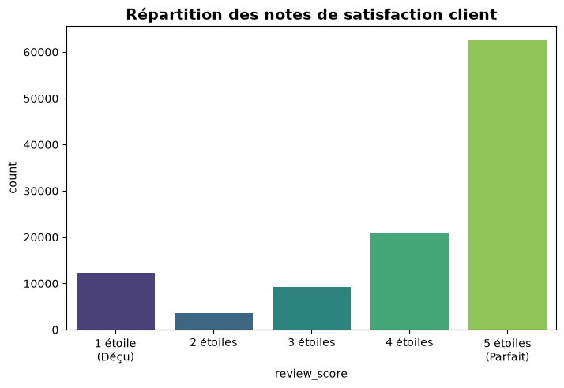
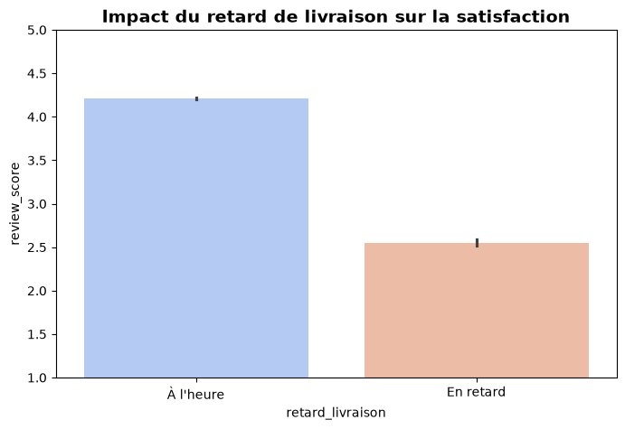

# Rapport de Projet : Intelligence Artificielle & Business Intelligence
**Sujet :** Prédiction de la Satisfaction Client en E-commerce (Dataset Olist)

---

## 1. Contexte et Méthodologie
L'objectif de ce projet est d'aider une entreprise e-commerce à comprendre et anticiper l'insatisfaction de ses clients. L'insatisfaction coûte cher en termes d'image et de fidélisation. 

Pour mener à bien ce projet, nous avons adopté une méthodologie rigoureuse :
- **Données :** Utilisation du dataset open-source *Olist Brazilian E-commerce* (Kaggle).
- **Gestion de projet :** Suivi des tâches via la méthode Agile sur **Trello**.
- **Versionning :** Sauvegarde et historique du code sur **GitHub**.
- **Data Engineering :** Fusion de 5 tables relationnelles et nettoyage des valeurs manquantes.

---

## 2. Business Intelligence (Analyse Exploratoire)

### A. La répartition de la satisfaction
Dans un premier temps, nous avons analysé la répartition globale des notes laissées par les clients.

**Interprétation :** 
Les avis sont fortement polarisés. La grande majorité des clients sont très satisfaits (5 étoiles), mais on observe un pic anormalement élevé de clients très insatisfaits (1 étoile). Le "ventre mou" (2 et 3 étoiles) est peu représenté. Il est donc crucial d'identifier la cause de ce pic d'insatisfaction.

+²
### B. L'impact des retards de livraison
Notre hypothèse principale était que la logistique influençait fortement la note. Nous avons donc calculé les délais de livraison et isolé les commandes en retard.

**Interprétation :**
Ce graphique prouve mathématiquement notre hypothèse. Une commande livrée à l'heure obtient une moyenne de 4,2/5. En revanche, une commande livrée en retard voit sa note chuter drastiquement à moins de 2,5/5. **Le retard de livraison est le facteur de friction numéro 1.**

---

## 3. Intelligence Artificielle (Machine Learning)

Puisque le retard cause la mauvaise note, nous avons développé un modèle d'Intelligence Artificielle capable de prédire si une commande va recevoir une mauvaise note (1 ou 2 étoiles) en fonction de ses caractéristiques (prix, frais de port, temps de livraison, retard).

### A. Modélisation et Déséquilibre des classes
Nous avons utilisé l'algorithme **Random Forest Classifier** (Forêt Aléatoire). 
Lors du premier entraînement, l'IA a été confrontée à un "déséquilibre de classes" (Imbalanced Dataset) : ayant vu beaucoup plus de bonnes notes que de mauvaises, elle peinait à détecter les clients insatisfaits (Rappel de 22%).

### B. Optimisation et Résultats finaux
Pour corriger cela, nous avons appliqué la technique de pondération `class_weight='balanced'`, forçant l'IA à pénaliser plus lourdement les erreurs sur les mauvaises notes.

**Résultats de l'évaluation sur les données de test (20%) :**
- **Précision globale (Accuracy) :** 84%
- **Rappel sur les mauvaises notes (Recall) :** 39% (Le score a presque doublé après optimisation).

**Le compromis Précision-Rappel :**
L'IA fait désormais quelques "fausses alertes" (elle prédit une mauvaise note pour un client qui sera finalement satisfait), mais elle détecte beaucoup plus de clients réellement en colère. D'un point de vue métier, ce compromis est excellent.

---

## 4. Conclusion et Recommandations Métier

Grâce à l'alliance de la BI et de l'IA, nous pouvons formuler une recommandation claire pour l'entreprise :
Dès que notre modèle IA détecte qu'une commande en cours d'acheminement risque de générer une mauvaise note (notamment à cause d'un retard calculé), le service client doit **envoyer un email d'excuse proactif accompagné d'un code promotionnel**. 

Cette démarche de rétention proactive permettra de transformer un client potentiellement perdu en un client fidèle.
# 📘 Guide de Révision et Antisèche : Projet IA & BI E-commerce

Ce document résume l'intégralité du projet, les choix techniques, et les explications à donner au jury lors de la soutenance.

---

## 1. Résumé du Projet (Le Pitch de base)
**L'histoire du projet en 3 phrases :**
1. **La Data (Notebook 1) :** "J'ai fusionné 5 fichiers de la base de données Olist pour regrouper les clients, les commandes et les avis. J'ai nettoyé les données et calculé le temps de livraison réel."
2. **La BI (Notebook 2) :** "J'ai créé des graphiques qui ont prouvé que la majorité des clients sont satisfaits, mais que ceux qui sont livrés en retard mettent presque toujours une mauvaise note (1 étoile)."
3. **L'IA (Notebook 3) :** "J'ai entraîné un algorithme (Random Forest) pour qu'il apprenne à deviner à l'avance si un client va mettre une mauvaise note en regardant le retard et le prix."

---

## 2. Les Concepts Clés à expliquer au Professeur

### A. Le Feature Engineering (Création de variables)
* **Ce que c'est :** L'ordinateur ne comprend pas les dates brutes. Nous avons donc soustrait la date d'achat à la date de livraison pour créer une nouvelle colonne : `temps_livraison_jours`.
* **Pourquoi c'est important :** C'est cette variable mathématique qui a permis à l'IA de comprendre la notion de "retard".

### B. Le Déséquilibre de Classes (Imbalanced Dataset)
* **Le problème :** Dans nos données, il y a 18 000 bonnes notes et seulement 3 000 mauvaises notes. Au début, l'IA était "biaisée" et avait peur de prédire des mauvaises notes (elle n'en détectait que 22%).
* **La solution :** Nous avons utilisé le paramètre `class_weight='balanced'`. Cela a donné un "mégaphone" aux mauvaises notes, forçant l'IA à y faire attention. Le score de détection (Recall) a alors doublé (39%).

### C. Le Compromis Précision-Rappel (Trade-off)
* **L'explication métier :** En forçant l'IA à détecter plus de clients mécontents (Rappel), elle fait un peu plus de "fausses alertes" (baisse de la Précision). Mais d'un point de vue Business, il vaut mieux envoyer un code promo par erreur à un client content, plutôt que de rater un client très en colère qui ne reviendra plus jamais.

---

## 3. Explication du Code IA (Mot par Mot)

Si le professeur demande d'expliquer cette ligne : 
`modele_rf = RandomForestClassifier(n_estimators=100, max_depth=10, random_state=42, class_weight='balanced')`

Voici les réponses parfaites :
* **`RandomForestClassifier` :** C'est l'algorithme de la Forêt Aléatoire. Au lieu d'un seul arbre qui peut se tromper, c'est une armée d'arbres qui votent ensemble.
* **`n_estimators=100` :** C'est le nombre d'arbres. C'est comme un jury de 100 experts qui analysent le client et votent à la majorité.
* **`max_depth=10` :** C'est la limite de questions que l'arbre peut poser. Cela empêche le "Surapprentissage" (Overfitting), pour éviter que l'IA n'apprenne les données par cœur.
* **`random_state=42` :** C'est la "photo souvenir" du hasard. Cela fige l'aléatoire pour que le code soit reproductible et donne toujours les mêmes pourcentages. (Le 42 est une convention classique en informatique).
* **`class_weight='balanced'` :** C'est l'équilibrage. Cela dit à l'IA que se tromper sur un client en colère coûte beaucoup plus cher que se tromper sur un client content.

---

## 4. Le Benchmark (Le combat des algorithmes)

Si le professeur demande : *"Pourquoi avoir choisi le Random Forest ?"*
* **La réponse :** "Je n'ai pas choisi au hasard. J'ai fait un Benchmark (une comparaison) avec la Régression Logistique et un Arbre de Décision simple. Le Random Forest a gagné car la méthode de vote à plusieurs arbres (Ensemble Learning) le rend beaucoup plus robuste et stable face à des données complexes."

---

## 5. Guide de Survie pendant la Soutenance 🚨

* **Si tu as oublié un code :** *"Je n'ai plus la syntaxe exacte en tête, mais la logique algorithmique serait d'utiliser une boucle ou un filtre pour isoler cette donnée."*
* **Si le prof te demande de modifier le code et qu'il y a une erreur rouge :** Ne panique pas. Lis la dernière ligne de l'erreur à voix haute et dis : *"C'est une erreur de mémoire, je dois juste relancer la cellule du dessus pour que l'ordinateur prenne en compte la modification."*
* **La règle d'or :** Avant que le prof n'arrive, clique sur "Run All" (Exécuter tout) dans tes 3 Notebooks pour que tous les graphiques soient déjà affichés à l'écran.
